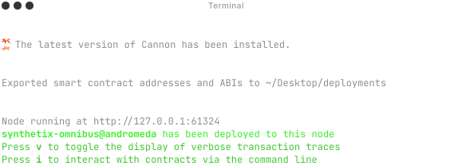

# Cannon



Cannon is a DevOps tool for EVM chains. It's a tool for testing, deploying, and publishing of smart contracts.

This is the monorepo for Cannon. If you're just interested in using the project, [visit the website](https://usecannon.com).

**⚠️ Cannon is under active development. While the interface and functionality are generally stable, use the tool with caution when conducting high-risk deployments.**

For more information, please see documentation in the modules listed below:

- [`api`](packages/api): Backend for the website.
- [`cli`](packages/cli): The command-line interface. Run `npx @usecannon/cli --help` for usage information.
- [`builder`](packages/builder): Builds chain data from cannonfiles. (This is used by the CLI.)
- [`hardhat-cannon`](packages/hardhat-cannon): Code for the Hardhat plug-in, which wraps the CLI functionality with defaults pulled from a Hardhat project configuration.
- [`indexer`](packages/indexer): Processes all data for cannon into a Redis database. Used on the website.
- [`registry`](packages/registry): The smart contract for the package registry.
- [`repo`](packages/repo): Backend for our homegrown IPFS hosting service.
- [`website`](packages/website): The website, hosted at https://usecannon.com.

Usage Examples:

- [`router-architecture`](examples/router-architecture): Project demonstrating how to setup an upgradable [Router Architecture](https://www.npmjs.com/package/@synthetixio/router).
- [`sample-hardhat-project`](examples/sample-hardhat-project): Hardhat project that demonstrates the core functionality of the `hardhat-cannon` module
- [`sample-foundry-project`](examples/sample-hardhat-project): Foundry project that demonstrates the core functionality of the `cli` module

Cannon is 100% open-source, from the dev tooling to our hosted infrastructure.

## Development

Community contributions to Cannon are greatly appreciated. Please open pull requests, issues, and discussions in the GitHub repository.

To load a development version of Cannon, first start by making sure you have the correct node and [pnpm](https://pnpm.io/installation) versions installed.

Then, install the dependencies from the root directory:

```
pnpm i
```

After making changes, rebuild the project:

```
pnpm build
```

Use the development version of the CLI:

```
cd ./packages/cli && pnpm start -- <package:version>
```

Test changes to the Hardhat plug-in in the sample project:

```
cd ./examples/sample-hardhat-project && pnpm hardhat cannon:build
```

Preview updates to the website

```
cd ./packages/website && pnpm dev
```

### Contribution Guidelines

See [CONTRIBUTING.md](./CONTRIBUTING.md)

### Version and Publish

We bump and publish manually using lerna's [version and publish](https://lerna.js.org/docs/features/version-and-publish) workflow.

#### Stable Release

1. To create a `stable` release, first checkout to a new branch (it can be called `release-stable` or something similar)

- Note, DO NOT use the version name as the branch name as this can cause conflicts with tags. (eg `v2.12.1` as a branch name is incorrect)

2. Run `pnpm run version-*` where `*` can be patch, minor or major.
3. Create PR for the release branch
4. From the branch, run `pnpm run publish` and follow the prompts.
5. Run `pnpm run update-stables` to make sure that all the other private packages reference to new release.
6. Merge release PR

#### Alpha Release

1. To create an `alpha` release, first checkout to a new branch (it can be called `release-alpha` or something similar)

- Note, DO NOT use the version name as the branch name as this can cause conflicts with tags. (eg `v2.12.1-alpha.0` as a branch name is incorrect)

2. Run `pnpm version-alpha` to bump package versions to an alpha version.
3. Create PR for the branch and merge when required tests are passing
4. From the `main` branch, run `pnpm publish-alpha` and follow the prompts.

#### Dependabot Configuration

To keep Cannon updated, we recommend using dependabot to regularly check for updates.

Below is an example of a dependabot configuration that checks daily for cannon updates and applies them:

```
updates:
  - package-ecosystem: "npm"
    directory: "/"
    schedule:
      interval: "daily"
    groups:
      cannon:
        patterns:
          - "@usecannon*"
          - "*cannon*"
```

#### Changesets

We can also use [changesets](https://github.com/changesets/changesets) to manage versions on our monorepo.

Currently our [release workflow](.github/workflows/release.yml) on our CI handles bumping package versions and publishing releases to npm through lerna.
It only publishes releases if any changeset PR's have been added to the commit history merged into main.

To trigger a new version bump run the following command (from the root of the repo):

```
  pnpm changeset
```

## License

[](https://www.gnu.org/licenses/gpl-3.0)

This project is licensed under the terms of the GNU General Public License v3.0.

Copyright (C) 2024 Taihou Technologies
